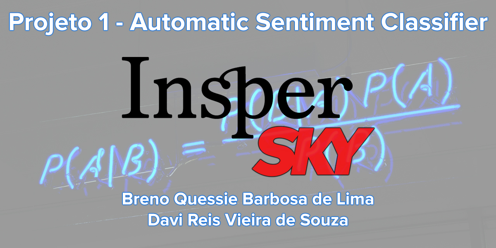

# Projeto 1 - Automatic Sentiment Classifier

PT-BR:

Fomos contratados por uma empresa para analisar como os clientes estão reagindo a um
determinado produto no Twitter. A empresa deseja que criemos um programa que selecione
algumas mensagens disponíveis no Twitter que mencionam esse produto e classifique-as como
"relevante" ou "irrelevante".

Com isso, essa empresa deseja que mensagens relevantes, que denigrem o nome do produto,
ou que mereçam destaque, disparem um foco de atenção da área de marketing.

Como aluno de Ciência dos Dados, lembramos do Teorema de Bayes, mais especificamente
do Classificador Naive-Bayes, que é largamente utilizado em filtros anti-spam de e-mails, por
exemplo. Esse classificador permite calcular qual a probabilidade de uma mensagem ser
relevante dada as palavras em seu conteúdo.

Para realizar o MVP (minimum viable product) do projeto, precisamos implementar uma
versão do classificador que "aprende" o que é relevante com uma base de treinamento e
compara a performance dos resultados com uma base de testes.
Após validado, o nosso protótipo poderá também capturar e classificar automaticamente as
mensagens da plataforma.

EN:

We were hired by a company to analyze how customers are reacting to a
particular product on Twitter. The company wants us to create a program that selects
some messages available on Twitter that mention this product and classify them as
"relevant" or "irrelevant".

With this, this company wants relevant messages, which denigrate the name of the product,
or that deserve prominence, trigger a focus of attention from the marketing area.

As a student of Data Science, we remember the Bayes Theorem, more specifically
the Naive-Bayes Classifier, which is widely used in anti-spam email filters, for example
example. This classifier allows you to calculate how likely a message is to be
relevant given the words in your content.

To carry out the project's MVP (minimum viable product), we need to implement a
version of the classifier that "learns" what is relevant with a training base and
compares the performance of the results with a test base.
Once validated, our prototype will also be able to automatically capture and classify the
platform messages.
